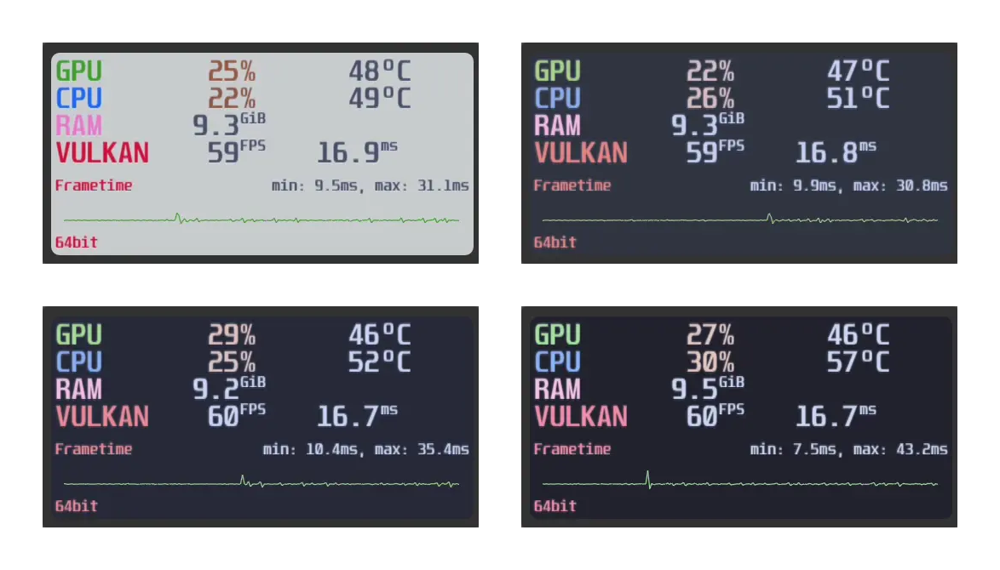
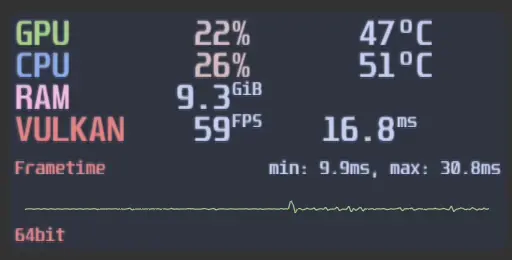
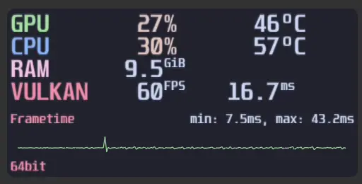

<h3 align="center">
	 
	
	Catppuccin for <a href="https://github.com/flightlessmango/MangoHud">MangoHud</a>
	
</h3>

	
	
	

	

## Previews

🌻 Latte

🪴 Frappé

🌺 Macchiato

🌿 Mocha

## Usage

1. Download the flavor of your choice.
2. Place the file in `~/.config/MangoHud/`
> For Per-application configuration, follow the [Hud configuration](https://github.com/flightlessmango/MangoHud#hud-configuration) section and paste the content of the theme file inside.

<!-- The FAQ section is optional. Remove if needed.-->
## 🙋 FAQ

- Q: **_"How can I change X?"_**\
  A: You can follow the [Environment Variables](https://github.com/flightlessmango/MangoHud#environment-variables) section and the [config template](https://github.com/flightlessmango/MangoHud/blob/master/data/MangoHud.conf) file which gives you every variables to further customize your hud. You can also use [GOverlay](https://github.com/benjamimgois/goverlay) for a GUI editor.

## 💝 Thanks to

- [claymorwan](https://github.com/claymorwan)

&nbsp;

	

	Copyright &copy; 2021-present <a href="https://github.com/catppuccin" target="_blank">Catppuccin Org</a>

	

